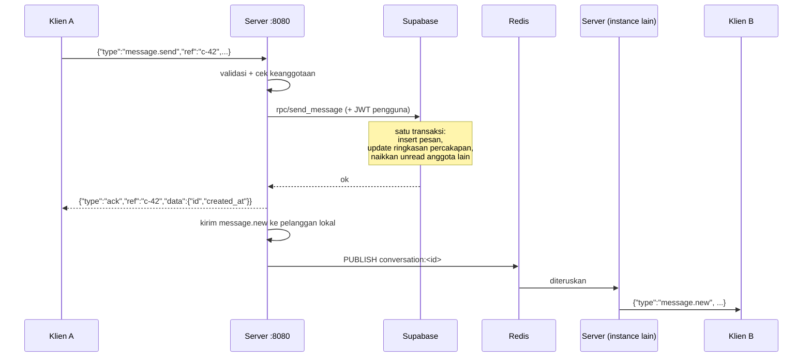

# Syntra API — Kontrak Integrasi

Dokumen rujukan untuk siapa pun yang menyambungkan klien ke backend Syntra.
Berisi seluruh endpoint REST, seluruh frame WebSocket, alur multi-langkah, dan
bentuk data persisnya.

Kalau dokumen ini berbeda dengan kode, **kode yang benar** — dan itu bug di
dokumen ini yang harus diperbaiki.

> **Untuk yang mengubah backend:** setiap penambahan, perubahan, atau
> penghapusan endpoint **wajib ikut mengubah dokumen ini** — tabel ringkasan
> rute di §3 *dan* bagian detail endpointnya. Aplikasi membangun kliennya dari
> sini; endpoint yang tidak tercatat sama saja dengan tidak ada.
>
> Verifikasi dengan dua skrip sebelum commit:
> `server/scripts/check-docs.ps1` (dokumen vs kode) dan
> `server/scripts/smoke.ps1` (endpoint benar-benar jalan).

- Base URL lokal: `http://localhost:8081` (lewat nginx) atau `:8080` (langsung)
- Semua path REST berawalan `/api/v1`
- Semua timestamp **RFC3339 UTC**, contoh `2026-07-23T09:12:04Z`
- Semua id **UUID v7** — terurut secara waktu, jadi bisa dipakai sebagai cursor

---

## 1. Autentikasi

Token adalah **JWT dari Supabase Auth**, bukan token terbitan server ini.

```
Klien login via Supabase SDK   →  JWT
        ↓
Authorization: Bearer <jwt>    →  backend Syntra
        ↓
verifikasi ke /auth/v1/user    →  Supabase   (hasil di-cache 1 menit)
        ↓
JWT diteruskan ke tiap query   →  auth.uid() terisi  →  RLS lolos
```

Kalau JWT tidak ikut terkirim, `auth.uid()` bernilai NULL dan **semua query
mengembalikan nol baris tanpa error yang jelas.** Itu penyebab nomor satu dari
gejala "kodenya benar tapi datanya kosong".

### Cara mengirim token

| Cara | Berlaku untuk |
|---|---|
| `Authorization: Bearer <jwt>` | REST dan WebSocket — cara utama |
| `?token=<jwt>` | **hanya** `/api/v1/ws`, karena WebSocket API di browser tidak bisa menyetel header |
| `X-Debug-User: <user-id>` | hanya kalau `AUTH_DEV_BYPASS=true` dan `APP_ENV` bukan production |

### Endpoint auth

**Pakai endpoint backend ini, jangan memanggil Supabase langsung.** Alasannya
bukan kerapian: Supabase Auth hanya membuat baris di `auth.users`, sedangkan
tabel aplikasi (`users`, `user_profiles`, `user_settings`) tidak ikut terisi.
Akun hasil pendaftaran langsung ke Supabase **bisa login tetapi tidak punya
profil** — setiap query mengembalikan kosong tanpa pesan yang menjelaskan.

Ini bukan kemungkinan teoretis; sempat terjadi 4 baris `auth.users` berbanding
3 `public.users` di proyek ini.

#### `POST /api/v1/auth/register`

```json
{
  "email": "budi@syntra.app",
  "password": "rahasia123",
  "username": "budi",
  "display_name": "Budi Santoso",
  "date_of_birth": "1998-05-12"
}
```

Hanya `email` dan `password` yang wajib. Username kosong akan diturunkan dari
email, dan bentrok diselesaikan dengan sufiks angka — pendaftaran tidak pernah
gagal karena nama sudah dipakai.

Balasan `201` berisi sesi yang langsung bisa dipakai (lihat bentuk di bawah).

Kegagalan: `409` email sudah terdaftar · `400` kata sandi kurang dari 6
karakter atau email tidak valid · **`429` batas pendaftaran Supabase** — free
tier tanpa SMTP kustom hanya mengizinkan beberapa signup per jam.

#### `POST /api/v1/auth/login`

```json
{ "email": "budi@syntra.app", "password": "budi123456" }
```

```json
{ "data": {
    "access_token": "eyJhbGciOi...",
    "refresh_token": "dxh2wralne4u",
    "token_type": "bearer",
    "expires_in": 3600,
    "user_id": "6f77d0ad-...",
    "email": "budi@syntra.app",
    "username": "budi",
    "display_name": "Budi Santoso"
} }
```

Login juga menjadi jaring pengaman: kalau akun ternyata belum punya profil, ia
dibuat di sini.

Kegagalan: `401` email atau kata sandi salah. Pesan sengaja tidak membedakan
keduanya — memberi tahu mana yang salah berarti memberi tahu penyerang akun
mana yang benar-benar ada.

#### `POST /api/v1/auth/refresh`

```json
{ "refresh_token": "dxh2wralne4u" }
```

Access token berumur **1 jam**. Panggil endpoint ini saat menerima `401`, lalu
ulangi permintaan yang gagal. `401` di sini berarti pengguna harus login ulang.

#### `POST /api/v1/auth/logout`

Butuh `Authorization: Bearer <token>`. Balasan `204`, dan tetap `204` meski
token sudah kedaluwarsa — dari sudut pandang pengguna, "keluar" tidak boleh
bisa gagal.

#### `pending_confirmation`

Kalau proyek Supabase mewajibkan konfirmasi email, `register` membalas dengan
`access_token` kosong dan `pending_confirmation: true`. Akunnya sudah dibuat;
arahkan pengguna ke kotak masuknya, dan profil akan terbentuk saat login pertama.

---

## 2. Bentuk response

Semua endpoint REST memakai pembungkus yang sama.

```jsonc
{ "data": { } }                                    // sukses
{ "data": [ ], "meta": { "count": 12 } }           // sukses berpaginasi
{ "error": { "code": "forbidden",
             "message": "...",
             "request_id": "019f8e5a-..." } }      // gagal
```

`request_id` juga dikirim sebagai header `X-Request-ID` dan muncul di setiap
baris log server. Sertakan nilai itu saat melaporkan masalah.

### Kode error

Identik antara REST dan WebSocket, sehingga klien cukup punya **satu**
penerjemah error untuk kedua transport.

| Kode | HTTP | Arti | Yang sebaiknya dilakukan klien |
|---|---|---|---|
| `bad_request` | 400 | payload/parameter salah | perbaiki permintaan; jangan diulang apa adanya |
| `unauthorized` | 401 | token tidak ada/kedaluwarsa | refresh token lalu ulangi |
| `forbidden` | 403 | tidak berhak | jangan diulang |
| `not_found` | 404 | tidak ada | jangan diulang |
| `conflict` | 409 | bentrok status | belum dipakai |
| `payload_too_large` | 413 | body > 1 MB | perkecil |
| `rate_limited` | 429 | terlalu sering | mundur eksponensial |
| `internal` | 500 | kesalahan server | ulangi dengan backoff |
| `unknown_type` | — | khusus WS: tipe frame tak dikenal | bug klien |

---

## 3. Ringkasan seluruh rute

Seluruh baris di tabel ini **diverifikasi jalan** lewat `server/scripts/smoke.ps1`.

| Method | Path | Auth |
|---|---|---|
| `GET` | `/healthz` | — |
| `GET` | `/readyz` | — |
| `POST` | `/api/v1/auth/register` | — |
| `POST` | `/api/v1/auth/login` | — |
| `POST` | `/api/v1/auth/refresh` | — |
| `POST` | `/api/v1/auth/logout` | ✅ |
| `GET` | `/api/v1/conversations` | ✅ |
| `POST` | `/api/v1/conversations` | ✅ |
| `GET` | `/api/v1/conversations/{id}/messages` | ✅ |
| `POST` | `/api/v1/conversations/{id}/messages` | ✅ |
| `DELETE` | `/api/v1/conversations/{id}/messages` | ✅ |
| `DELETE` | `/api/v1/messages/{id}` | ✅ |
| `DELETE` | `/api/v1/conversations/{id}/messages/{message_id}` | ✅ |
| `GET` | `/api/v1/conversations/{id}` | ✅ |
| `PATCH` | `/api/v1/conversations/{id}` | ✅ |
| `POST` | `/api/v1/conversations/{id}/leave` | ✅ |
| `PUT` | `/api/v1/conversations/{id}/mute` | ✅ |
| `GET` | `/api/v1/conversations/{id}/members` | ✅ |
| `POST` | `/api/v1/conversations/{id}/members` | ✅ |
| `DELETE` | `/api/v1/conversations/{id}/members/{user_id}` | ✅ |
| `PATCH` | `/api/v1/conversations/{id}/members/{user_id}` | ✅ |
| `GET` | `/api/v1/conversations/{id}/reactions` | ✅ |
| `PUT` | `/api/v1/messages/{id}/reaction` | ✅ |
| `POST` | `/api/v1/calls` | ✅ |
| `POST` | `/api/v1/calls/{id}/answer` | ✅ |
| `POST` | `/api/v1/calls/{id}/decline` | ✅ |
| `POST` | `/api/v1/calls/{id}/leave` | ✅ |
| `GET` | `/api/v1/conversations/{id}/call` | ✅ |
| `GET` | `/api/v1/stories` | ✅ |
| `POST` | `/api/v1/stories` | ✅ |
| `GET` | `/api/v1/stories/me` | ✅ |
| `POST` | `/api/v1/stories/{id}/view` | ✅ |
| `GET` | `/api/v1/stories/{id}/viewers` | ✅ |
| `DELETE` | `/api/v1/stories/{id}` | ✅ |
| `GET` | `/api/v1/users/{username}` | ✅ |
| `POST` | `/api/v1/users/{username}/follow` | ✅ |
| `DELETE` | `/api/v1/users/{username}/follow` | ✅ |
| `GET` | `/api/v1/users/me` | ✅ |
| `PATCH` | `/api/v1/users/me` | ✅ |
| `GET` | `/api/v1/users/me/blocked` | ✅ |
| `POST` | `/api/v1/users/{username}/block` | ✅ |
| `DELETE` | `/api/v1/users/{username}/block` | ✅ |
| `POST` | `/api/v1/devices` | ✅ |
| `DELETE` | `/api/v1/devices/{id}` | ✅ |
| `POST` | `/api/v1/reports` | ✅ |
| `GET` | `/api/v1/users/me/following` | ✅ |
| `GET` | `/api/v1/users/me/follow-requests` | ✅ |
| `POST` | `/api/v1/users/{username}/follow/approve` | ✅ |
| `POST` | `/api/v1/users/{username}/follow/reject` | ✅ |
| `GET` | `/api/v1/rooms` | ✅ |
| `POST` | `/api/v1/rooms` | ✅ |
| `POST` | `/api/v1/rooms/{id}/join` | ✅ |
| `POST` | `/api/v1/rooms/{id}/leave` | ✅ |
| `POST` | `/api/v1/rooms/{id}/end` | ✅ |
| `DELETE` | `/api/v1/rooms/{id}` | ✅ |
| `GET` | `/api/v1/rooms/{id}/requests` | ✅ |
| `POST` | `/api/v1/rooms/{id}/requests/{user_id}/approve` | ✅ |
| `POST` | `/api/v1/rooms/{id}/requests/{user_id}/reject` | ✅ |
| `GET` | `/api/v1/rooms/{id}/participants` | ✅ |
| `PATCH` | `/api/v1/rooms/{id}/participants` | ✅ |
| `POST` | `/api/v1/rooms/{id}/raise-hand` | ✅ |
| `DELETE` | `/api/v1/rooms/{id}/raise-hand` | ✅ |
| `GET` | `/api/v1/rooms/{id}/speak-requests` | ✅ |
| `POST` | `/api/v1/rooms/{id}/invite` | ✅ |
| `PATCH` | `/api/v1/rooms/{id}/mute` | ✅ |
| `GET` | `/api/v1/notifications` | ✅ |
| `GET` | `/api/v1/notifications/unread-count` | ✅ |
| `POST` | `/api/v1/notifications/read` | ✅ |
| `POST` | `/api/v1/media/upload-url` | ✅ |
| `POST` | `/api/v1/media/{id}/confirm` | ✅ |
| `GET` | `/api/v1/reels` | ✅ |
| `POST` | `/api/v1/reels` | ✅ |
| `GET` | `/api/v1/reels/me` | ✅ |
| `GET` | `/api/v1/reels/saved` | ✅ |
| `GET` | `/api/v1/reels/{id}` | ✅ |
| `DELETE` | `/api/v1/reels/{id}` | ✅ |
| `PUT` | `/api/v1/reels/{id}/like` | ✅ |
| `DELETE` | `/api/v1/reels/{id}/like` | ✅ |
| `PUT` | `/api/v1/reels/{id}/save` | ✅ |
| `DELETE` | `/api/v1/reels/{id}/save` | ✅ |
| `POST` | `/api/v1/reels/{id}/view` | ✅ |
| `GET` | `/api/v1/reels/{id}/comments` | ✅ |
| `POST` | `/api/v1/reels/{id}/comments` | ✅ |
| `DELETE` | `/api/v1/reels/{id}/comments/{comment_id}` | ✅ |
| `GET` | `/api/v1/users/{username}/reels` | ✅ |
| `GET` | `/api/v1/ws` | ✅ |

Sumbernya: [`server/internal/transport/rest/router.go`](../server/internal/transport/rest/router.go).

---

## 4. Kesehatan

### `GET /healthz`

Tidak menyentuh dependensi apa pun. Selalu 200 selama proses hidup.

```json
{ "status": "ok", "version": "dev" }
```

### `GET /readyz`

Memeriksa Supabase dan Redis, batas 3 detik. `200` kalau sehat, `503` kalau tidak.

```json
{ "ready": true, "version": "dev",
  "dependencies": { "supabase": "ok", "redis": "ok" } }
```

---

## 5. Percakapan

### `GET /api/v1/conversations`

Daftar chat, terbaru dulu. Inilah sumber data layar utama.

| Query | Default | Catatan |
|---|---|---|
| `limit` | 30 | maksimum 100 |
| `before` | sekarang | RFC3339; ambil dari `meta.next_before` |

```json
{
  "data": [{
    "id": "019f8e5a-...",
    "type": "direct",
    "title": "Reza Ramadhan",
    "avatar_media_id": "019f8e12-...",
    "counterpart_id": "4e127292-...",
    "counterpart_last_read_id": "019f8e5a-...",
    "unread_count": 3,
    "last_message_preview": "oke besok ya",
    "last_message_type": "text",
    "last_message_sender_id": "4e127292-...",
    "last_message_at": "2026-07-23T09:12:04Z",
    "created_at": "2026-07-20T02:00:00Z"
  }],
  "meta": { "count": 1, "next_before": "2026-07-23T09:12:04Z" }
}
```

Catatan penting untuk klien:

- **`title` sudah berisi nama lawan bicara** untuk `type: "direct"` — klien
  tidak perlu mencari siapa peserta lain. Untuk grup berisi judul grup.
- **`counterpart_id`** hanya ada pada `direct`. Pakai ini untuk kueri presence
  dan untuk membuka profil.
- **`last_message_type`** berguna saat `last_message_preview` kosong: media
  tidak punya teks, jadi tampilkan "📷 Foto" berdasarkan tipe.
- **`counterpart_last_read_id`** adalah bahan indikator ✓✓ untuk chat `direct`.
  Karena id memakai UUIDv7 yang terurut waktu, klien cukup membandingkan:
  `pesan.id <= counterpart_last_read_id` berarti **sudah dibaca**. Tidak perlu
  tabel receipt per pesan — untuk grup 200 orang, satu pesan akan berarti 200
  baris receipt.
- Pagination memakai cursor waktu, bukan `offset`. Daftar ini berubah urutan
  setiap ada pesan masuk, dan `offset` akan melewatkan atau menggandakan baris.

### `POST /api/v1/conversations`

Memulai percakapan. **Untuk `direct`, operasi ini idempoten** — memanggilnya
lagi dengan orang yang sama mengembalikan percakapan yang sudah ada. Klien
boleh memanggilnya setiap kali pengguna menekan "kirim pesan" tanpa memeriksa
dulu.

```jsonc
// chat pribadi
{ "type": "direct", "user_id": "4e127292-..." }

// grup
{ "type": "group", "title": "Tim Syntra",
  "member_ids": ["4e127292-...", "0192f3a1-..."] }
```

```json
{ "data": { "id": "019f8e5a-..." } }
```

`403 forbidden` kalau salah satu pihak memblokir yang lain.

### `GET /api/v1/conversations/{id}/messages`

Riwayat pesan, **terbaru dulu**.

| Query | Default | Catatan |
|---|---|---|
| `limit` | 50 | maksimum 100 |
| `before` | — | **id pesan**, bukan waktu; ambil dari `meta.next_before` |

```json
{
  "data": [{
    "id": "019f8e5a-...",
    "conversation_id": "019f8e12-...",
    "sender_id": "4e127292-...",
    "type": "text",
    "body": "halo",
    "reply_to_id": null,
    "attachments": [],
    "created_at": "2026-07-23T09:12:04Z",
    "edited_at": null,
    "is_deleted": false
  }],
  "meta": { "count": 1, "next_before": "019f8e5a-..." }
}
```

`attachments` adalah **daftar URL siap-pakai** hasil resolusi media yang
dilampirkan (lihat §8). Kosong untuk pesan teks murni. Pesan `type: "system"`
punya `sender_id: null` — itu pengumuman otomatis (anggota masuk/keluar, judul
grup berubah); tampilkan rata tengah, bukan sebagai gelembung chat.

Cursor memakai **id**, bukan `created_at`. Dua pesan bisa punya waktu yang
identik di percakapan ramai, dan cursor waktu akan melewatkan salah satunya.

`is_deleted: true` berarti `body` sengaja dikosongkan — tampilkan "pesan ini
dihapus" di posisi itu, jangan sembunyikan barisnya.

**Endpoint ini juga alat sinkronisasi ulang.** Redis Pub/Sub bersifat
at-most-once: kalau ada instance server restart, event yang lewat saat itu
hilang. Karena itu setiap kali socket terhubung kembali, klien wajib memanggil
endpoint ini untuk percakapan yang sedang terbuka.

### `POST /api/v1/conversations/{id}/messages`

Jalur cadangan mengirim pesan saat WebSocket sedang terputus.

```json
{ "type": "text", "body": "halo", "reply_to_id": null, "media_ids": [] }
```

Balasan `201` berisi objek pesan yang sama bentuknya dengan di riwayat.

Memanggil service yang sama persis dengan frame `message.send`, jadi validasi
dan otorisasinya identik. Batas panjang teks: **4000 karakter**.

**Melampirkan media (foto/video/dokumen/voice note).** Isi `media_ids` dengan
id media yang **sudah dikonfirmasi** lewat alur tiga langkah di §8. Maksimum
**10 lampiran** per pesan, dan hanya media milik pengirim yang diterima.
Pesan boleh berupa media murni (tanpa `body`), atau teks + media sekaligus;
kalau ada lampiran, `type` otomatis menjadi `media`. Balasan berisi
`attachments` sebagai daftar URL siap tampil.

### `DELETE /api/v1/messages/{id}`

Menghapus satu pesan. Hanya pengirimnya — `403` untuk yang lain. Balasan `204`.

> Alias: `DELETE /api/v1/conversations/{id}/messages/{message_id}` melakukan hal
> yang sama persis (bentuk bersarang RESTful). Pakai yang mana pun.

**Soft delete.** Barisnya tetap muncul di riwayat dengan `is_deleted: true` dan
`body` kosong, supaya urutan pesan tidak berlubang bagi peserta lain. Tampilkan
sebagai "pesan ini dihapus".

### `DELETE /api/v1/conversations/{id}/messages`

Mengosongkan riwayat percakapan **hanya untuk pemanggil**. Balasan `204`.

Peserta lain tetap melihat percakapannya utuh — menghapus pesan dari layar orang
lain bukan wewenang siapa pun di dalam percakapan. Yang dicatat adalah batas
baca, jadi pesan baru setelah ini tetap muncul seperti biasa.

---

## 5b. Grup & anggota (fitur ala WhatsApp)

Semua endpoint di bawah hanya berlaku untuk anggota percakapan; yang bukan
anggota selalu `403`. Untuk aksi khusus admin/pemilik, non-admin juga `403`.

### `GET /api/v1/conversations/{id}`

Detail satu percakapan beserta peran pemanggil.

```json
{
  "data": {
    "id": "019f8e12-...",
    "type": "group",
    "title": "Tim Proyek",
    "avatar_url": "https://.../avatar.jpg",
    "member_count": 4,
    "my_role": "admin",
    "is_muted": false,
    "created_at": "2026-07-20T02:00:00Z"
  }
}
```

`my_role` bernilai `owner`, `admin`, atau `member`. Untuk chat pribadi
(`type: "direct"`) field grup seperti `title` bisa `null`.

### `PATCH /api/v1/conversations/{id}`

Mengubah judul dan/atau avatar grup. **Hanya admin/pemilik.** Hanya untuk grup —
chat pribadi membalas `400`.

```json
{ "title": "Nama Baru", "avatar_media_id": "019f8e77-..." }
```

Kedua field opsional; kirim yang mau diubah saja. Perubahan menghasilkan pesan
sistem di percakapan dan siaran `conversation.updated`. Balasan `200` berisi
detail terbaru (bentuk sama dengan `GET`).

### `POST /api/v1/conversations/{id}/leave`

Keluar dari grup. Balasan `204`. Kalau yang keluar adalah **pemilik**,
kepemilikan otomatis berpindah ke admin tertua (atau anggota tertua bila tak ada
admin). Grup yang ditinggal kosong akan berhenti tampil bagi mantan anggota.
Sebuah pesan sistem "X keluar" diterbitkan.

### `PUT /api/v1/conversations/{id}/mute`

Membisukan / membunyikan notifikasi percakapan **hanya untuk pemanggil**.
Terima dua bentuk — pakai salah satu:

```json
{ "duration_minutes": 480 }   // bisukan 8 jam
{ "duration_minutes": null }  // bunyikan lagi
{ "muted_until": "2026-07-25T00:00:00Z" }  // alternatif waktu absolut
```

`duration_minutes` bernilai `null`/`0` (atau `muted_until: null`) berarti
membunyikan kembali. Balasan `204`. Ini preferensi personal — tidak memengaruhi
anggota lain dan tidak menghentikan pesan tetap masuk, hanya menekan notifikasi
push.

### `GET /api/v1/conversations/{id}/members`

Daftar anggota beserta peran.

```json
{
  "data": [
    { "user_id": "4e12...", "username": "budi", "display_name": "Budi",
      "avatar_url": null, "role": "owner", "joined_at": "2026-07-20T02:00:00Z" }
  ],
  "meta": { "count": 1 }
}
```

### `POST /api/v1/conversations/{id}/members`

Menambah anggota ke grup. **Hanya admin/pemilik.**

```json
{ "user_ids": ["7a90...", "8b01..."] }
```

Balasan `200` berisi daftar anggota terbaru. Anggota yang pernah keluar akan
dihidupkan kembali. Pengguna yang saling blokir dengan penambah dilewati diam-
diam. Setiap penambahan menghasilkan pesan sistem dan siaran
`conversation.updated`.

### `DELETE /api/v1/conversations/{id}/members/{user_id}`

Mengeluarkan anggota. **Hanya admin/pemilik.** Pemilik tidak bisa dikeluarkan
(`403`). Balasan `204`, dengan pesan sistem "X dikeluarkan".

### `PATCH /api/v1/conversations/{id}/members/{user_id}`

Mengubah peran anggota. **Hanya pemilik.**

```json
{ "role": "admin" }
```

`role` bernilai `admin` atau `member` (pemilik tidak dipindahtangankan lewat
sini — pakai transfer otomatis saat pemilik keluar). Balasan `204`.

### `GET /api/v1/conversations/{id}/reactions`

Reaksi emoji untuk sekumpulan pesan sekaligus, supaya klien tidak perlu satu
permintaan per pesan.

| Query | Catatan |
|---|---|
| `message_ids` | daftar id dipisah koma, wajib |

```json
{
  "data": [
    { "message_id": "019f8e5a-...", "user_id": "4e12...", "emoji": "👍",
      "created_at": "2026-07-23T09:13:00Z" }
  ],
  "meta": { "count": 1 }
}
```

### `PUT /api/v1/messages/{id}/reaction`

Memberi / mengganti / menghapus reaksi pemanggil pada sebuah pesan. Satu orang
punya paling banyak satu reaksi per pesan — mengirim emoji baru menggantikan
yang lama.

```json
{ "emoji": "❤️" }
```

Kirim `emoji` kosong (`""`) atau `null` untuk **menghapus** reaksi. Balasan
`204`. Pemanggil harus anggota percakapan pesan tersebut.

---

## 5c. Telepon & video call

Panggilan terikat pada sebuah percakapan (chat pribadi maupun grup) dan memakai
**LiveKit yang sama** dengan voice room (§ voice-rooms.md). Backend hanya
mencatat sesi, mengotorisasi peserta, dan menerbitkan token — audio/video tidak
pernah melewati backend. Kalau LiveKit belum dikonfigurasi, sesi tetap tercatat
tetapi `sfu_token` kosong (tak ada suara/gambar).

Siklusnya: **memulai → dering → jawab/tolak → selesai**. Saat panggilan baru
dimulai, peserta lain menerima event realtime `call.incoming` di topik
`conversation:<id>` — itulah yang membuat perangkat mereka berdering.

### `POST /api/v1/calls`

Memulai panggilan, atau **bergabung** ke panggilan yang sudah berlangsung di
percakapan itu (mencegah dua panggilan paralel).

```json
{ "conversation_id": "019f8e12-...", "kind": "video" }
```

`kind` bernilai `audio` atau `video`. Balasan `201`:

```json
{
  "data": {
    "call_id": "019f9a01-...",
    "sfu_room_id": "019f9a01-...",
    "sfu_token": "eyJhbGciOi...",
    "sfu_url": "wss://livekit.example",
    "is_new": true
  }
}
```

`is_new: false` berarti pemanggil bergabung ke panggilan yang sudah ada.
Sambungkan ke LiveKit memakai `sfu_url` + `sfu_token`. Untuk chat pribadi,
memanggil pihak yang saling blokir dibalas `403`.

### `POST /api/v1/calls/{id}/answer`

Menjawab panggilan masuk. Menerbitkan token SFU untuk penjawab dan menyiarkan
`call.answered`. Sertakan `?conversation_id=<id>` agar siaran terkirim.

```json
{ "data": { "call_id": "019f9a01-...", "sfu_room_id": "019f9a01-...",
  "sfu_token": "eyJ...", "sfu_url": "wss://livekit.example" } }
```

### `POST /api/v1/calls/{id}/decline`

Menolak panggilan masuk. Hanya efektif pada **chat pribadi** — di grup, satu
orang menolak tidak mengakhiri panggilan bagi yang lain. Balasan `204`,
menyiarkan `call.ended` (reason `declined`). Sertakan `?conversation_id=<id>`.

### `POST /api/v1/calls/{id}/leave`

Meninggalkan panggilan. Kalau tidak ada peserta tersisa, panggilan berakhir
(`ended`, atau `missed` bila belum sempat dijawab). Balasan `204`, menyiarkan
`call.ended` (reason `left`). Sertakan `?conversation_id=<id>`.

### `GET /api/v1/conversations/{id}/call`

Panggilan yang sedang berlangsung pada percakapan — untuk menampilkan tombol
"gabung panggilan" atau banner "sedang menelepon".

```json
{
  "data": {
    "id": "019f9a01-...",
    "kind": "video",
    "status": "ongoing",
    "initiator_id": "4e12...",
    "started_at": "2026-07-24T10:00:00Z"
  }
}
```

`data: null` kalau tidak ada panggilan aktif.

---

## 6. Story

### `GET /api/v1/stories`

Story aktif (< 24 jam) dari diri sendiri dan orang yang diikuti, **sudah
dikelompokkan per orang** dan diurutkan — milik sendiri paling depan.

Klien tidak perlu mengelompokkan atau mengurutkan apa pun.

```json
{
  "data": [{
    "author_id": "4e127292-...",
    "username": "admin",
    "display_name": "Admin",
    "avatar_media_id": "019f8e12-...",
    "is_current_user": true,
    "all_viewed": false,
    "unviewed_count": 2,
    "latest_story_at": "2026-07-23T08:00:00Z",
    "stories": [{
      "id": "019f8e77-...",
      "media_id": "019f8e70-...",
      "media_kind": "image",
      "media_url": "https://<ref>.supabase.co/storage/v1/object/public/media/...",
      "duration_ms": 0,
      "viewed": false,
      "created_at": "2026-07-23T07:30:00Z",
      "expires_at": "2026-07-24T07:30:00Z"
    }]
  }]
}
```

Pemetaan langsung ke UI story row:

| Field | Dipakai untuk |
|---|---|
| satu elemen `data` | satu avatar di story row |
| `len(stories)` | jumlah segmen pada ring |
| `all_viewed` | ring abu (true) atau berwarna (false) |
| `stories[].viewed` | segmen mana yang sudah ditonton |
| `media_kind` | `image` → tampil 5 detik; `video` → putar sampai selesai |
| `duration_ms` | durasi video, untuk progress bar |

### `POST /api/v1/stories`

Media harus **sudah diunggah dan dikonfirmasi** lebih dulu (bagian 8).

```json
{ "media_id": "019f8e70-...", "visibility": "followers" }
```

`visibility`: `public` | `followers` | `close_friends`. Default `followers`.
`403` kalau media bukan milik pemanggil.

### `POST /api/v1/stories/{id}/view`

Menandai sudah ditonton. Balasan `204`. Idempoten — menonton ulang tidak
menaikkan counter dua kali.

### `GET /api/v1/stories/me`

Story milik sendiri. Berbeda dari `GET /stories`: di sini yang menarik adalah
berapa orang menonton dan apakah masih tayang — bahan untuk layar arsip dan
untuk memilih mana yang mau dihapus.

| Query | Default | Arti |
|---|---|---|
| `include_expired` | `false` | `true` menyertakan yang sudah lewat 24 jam |

```json
{ "data": [{
    "id": "019f8e77-...",
    "media_id": "019f8e70-...",
    "media_kind": "image",
    "media_url": "https://.../object/public/media/...",
    "duration_ms": 0,
    "view_count": 12,
    "is_expired": false,
    "created_at": "2026-07-23T07:30:00Z",
    "expires_at": "2026-07-24T07:30:00Z"
}], "meta": { "count": 1 } }
```

### `GET /api/v1/stories/{id}/viewers`

Siapa saja yang menonton sebuah story, **terbaru dulu**.

**Hanya pemilik story yang boleh melihatnya** — `403` untuk siapa pun yang lain.
Membukanya ke penonton lain berarti memberi tahu siapa saja yang menyimak
seseorang, dan itu tidak pernah mereka setujui.

| Query | Default | Catatan |
|---|---|---|
| `limit` | 50 | maksimum 200 |
| `before_at` | — | RFC3339; ambil dari `meta.next_before_at` |
| `before_id` | — | ambil dari `meta.next_before_id` |

```json
{
  "data": [{
    "user_id": "d5891ae6-...",
    "username": "citra",
    "display_name": "Citra Dewi",
    "avatar_url": "https://.../object/public/media/...",
    "viewed_at": "2026-07-23T08:41:12Z"
  }],
  "meta": {
    "count": 1,
    "next_before_at": "2026-07-23T08:41:12Z",
    "next_before_id": "d5891ae6-..."
  }
}
```

**Cursor-nya berpasangan — kirim `before_at` DAN `before_id` bersamaan.** Dua
orang bisa menonton pada milidetik yang sama, dan cursor berbasis waktu saja
akan melewatkan salah satunya saat berpindah halaman.

Untuk **jumlah** penonton, tidak perlu memanggil endpoint ini: `view_count`
sudah ada di [`GET /api/v1/stories/me`](#get-apiv1storiesme). Panggil `viewers`
hanya saat pengguna membuka daftarnya.

`404` kalau story tidak ada atau sudah dihapus.

### `DELETE /api/v1/stories/{id}`

Menghapus story sendiri, foto maupun video. Balasan `204`.

`403` kalau story milik orang lain · `404` kalau tidak ada atau sudah dihapus.

Dua hal yang perlu diketahui soal perilakunya:

**Story disembunyikan, bukan dimusnahkan.** Barisnya tetap ada dengan
`deleted_at` terisi. Permintaan moderasi bisa datang setelah story hilang dari
layar, dan menghapus barisnya seketika membuat itu mustahil dijawab. Baris yang
sudah lama kedaluwarsa dibuang terpisah setelah masa tenggang tujuh hari.

**Medianya tidak ikut dihapus.** Satu `media_asset` boleh dipakai berkali-kali —
dikirim ulang sebagai pesan, misalnya — sehingga menghapus byte-nya bersama
story akan merusak tautan yang masih dipakai di tempat lain. Media yatim
dibersihkan oleh job terpisah, juga setelah masa tenggang.

Catatan tontonan (`story_views`) ikut dibuang: setelah story hilang, daftar
penontonnya tidak berguna dan hanya menyimpan siapa melihat apa tanpa alasan.

---

## 6c. Profil sendiri, blokir, perangkat, laporan

### `GET /api/v1/users/me`

Profil pemilik akun — termasuk yang **tidak** terlihat orang lain: email,
tanggal lahir, preferensi privasi.

```json
{ "data": {
    "id": "6f77d0ad-...",
    "username": "budi",
    "email": "budi@syntra.app",
    "display_name": "Budi Santoso",
    "bio": "",
    "avatar_url": "https://.../object/public/media/...",
    "cover_url": "https://.../object/public/media/...",
    "follower_count": 1,
    "following_count": 0,
    "is_private": false,
    "date_of_birth": "1998-05-12",
    "dm_privacy": "everyone",
    "story_privacy": "followers",
    "locale": "id"
} }
```

Berbeda dari `GET /users/{username}` yang hanya data publik. `avatar_url` /
`cover_url` kosong kalau belum diset.

### `PATCH /api/v1/users/me`

Ubah profil. **Kirim hanya field yang berubah** — yang tidak disertakan tidak
diubah. Balasannya profil terbaru (bentuk sama dengan `GET`).

```json
{ "display_name": "Budi S.", "bio": "halo", "username": "budi.s", "is_private": true }
```

| Field | Aturan |
|---|---|
| `display_name` | ≤ 60 karakter |
| `bio` | ≤ 200 karakter |
| `username` | 3–30 karakter, **diawali huruf**, hanya huruf kecil/angka/titik/garis bawah; unik. `409` kalau sudah dipakai, `400` kalau formatnya salah |
| `avatar_media_id` | id media (foto) milik sendiri yang sudah dikonfirmasi |
| `cover_media_id` | id media (foto sampul) milik sendiri |
| `is_private` | akun privat |
| `dm_privacy` | `everyone` \| `following` \| `nobody` |
| `story_privacy` | `public` \| `followers` \| `close_friends` |

Ganti foto profil/sampul: unggah lewat alur media §8 → ambil `media_id` →
`PATCH` dengan `avatar_media_id` / `cover_media_id`.

> **Email & kata sandi** tidak diubah di sini — keduanya milik Supabase Auth;
> aplikasi memakai Supabase SDK (`updateUser`) langsung untuk itu.

### Blokir

```
POST   /api/v1/users/{username}/block     → 204
DELETE /api/v1/users/{username}/block     → 204
GET    /api/v1/users/me/blocked           daftar yang diblokir
```

Memblokir **memutus follow dua arah**: yang diblokir berhenti menerima story dan
pembaruan dari yang memblokir, dan sebaliknya. Blokir juga menghalangi masuk
voice room dan memulai chat.

### Perangkat — untuk push notification (FCM)

```
POST   /api/v1/devices        daftarkan / perbarui push token
DELETE /api/v1/devices/{id}   cabut (mis. saat logout)
```

```json
{ "device_id": "uuid-perangkat", "platform": "android",
  "push_token": "token-fcm", "app_version": "1.0.0" }
```

`platform`: `android` | `ios` | `web`. Satu push token hanya boleh dimiliki satu
akun — kalau ponsel berpindah pengguna, pemilik lama otomatis berhenti menerima.

> Backend baru **menyimpan** token; pengiriman push FCM-nya sendiri belum ada.

### Laporan

```
POST /api/v1/reports          → 201
```

```json
{ "target_type": "story", "target_id": "019f...", "reason": "spam",
  "detail": "opsional" }
```

`target_type`: `user`|`reel`|`story`|`message`|`room`|`comment`.
`reason`: `spam`|`harassment`|`nudity`|`violence`|`csam`|`copyright`|`other`.

Laporan `csam` otomatis berprioritas kritis — kewajiban hukum dan SLA-nya
berbeda total dari spam.

---

## 7. Direktori pengguna & follow

### `GET /api/v1/users/{username}`

Sasaran hasil **scan QR**. Kode QR sebaiknya berisi username
(mis. `syntra://u/admin`), bukan UUID — lebih pendek, lebih mudah dipindai,
dan tidak membocorkan struktur internal.

```json
{ "data": {
    "id": "4e127292-...",
    "username": "admin",
    "display_name": "Admin",
    "avatar_media_id": "019f8e12-...",
    "follower_count": 12,
    "following_count": 30,
    "follow_status": "accepted",
    "is_self": false
} }
```

`follow_status` menentukan label tombol di layar profil:

| Nilai | Arti | Label tombol |
|---|---|---|
| `""` | belum diikuti | Follow |
| `"pending"` | menunggu persetujuan (akun privat) | Requested |
| `"accepted"` | sudah diikuti | Following |

Pencarian tidak membedakan huruf besar-kecil. `404` kalau tidak ada.

Alur lengkap scan QR:
`scan` → `GET /users/{username}` → tampilkan profil → `POST /conversations`
(`type: direct`) → buka layar chat.

### `POST /api/v1/users/{username}/follow`

Mulai mengikuti. **Idempoten** — menekan tombol dua kali tidak menggandakan
apa pun dan tidak menggelembungkan counter.

Balasannya adalah profil lengkap dengan `follow_status` terbaru, jadi klien
bisa langsung memperbarui tombol tanpa memuat ulang profil.

Akun publik langsung `accepted`; akun privat menjadi `pending` sampai disetujui.
`403` kalau salah satu pihak memblokir yang lain.

### `DELETE /api/v1/users/{username}/follow`

Berhenti mengikuti. Idempoten. Balasannya sama bentuknya.

### `GET /api/v1/users/me/following`

Daftar orang yang diikuti, urut menurut nama tampil.

```json
{ "data": [{
    "id": "4e127292-...",
    "username": "admin",
    "display_name": "Admin",
    "avatar_media_id": "019f8e12-...",
    "follow_status": "accepted",
    "followed_at": "2026-07-23T09:00:00Z"
}], "meta": { "count": 1 } }
```

### `GET /api/v1/users/me/follow-requests`

Permintaan follow yang menunggu keputusan — hanya relevan untuk akun privat
(`is_private: true`). Bentuknya sama dengan `me/following`.

### `POST /api/v1/users/{username}/follow/approve`
### `POST /api/v1/users/{username}/follow/reject`

Menyetujui atau menolak. Balasan `204`.

Tanpa kedua endpoint ini, akun privat menghasilkan status `pending` yang
menggantung selamanya: peminta tidak pernah menjadi pengikut, jadi tidak pernah
bisa melihat story. Kalau aplikasi belum punya layar ini, pakai akun publik.

> **Kalau story seseorang tidak muncul di story row, periksa endpoint ini
> dulu.** `GET /stories` hanya menampilkan story dari orang yang ada di daftar
> ini dengan status `accepted` — itu penyebab paling sering, bukan bug di story.

---

## 7b. Notifikasi

### `GET /api/v1/notifications`

Terbaru dulu. Cursor `before` adalah **id notifikasi** — id memakai UUIDv7 yang
terurut waktu, jadi tidak melewatkan baris ketika dua notifikasi lahir pada
milidetik yang sama.

| Query | Default | Catatan |
|---|---|---|
| `limit` | 30 | maksimum 100 |
| `before` | — | id notifikasi dari `meta.next_before` |

```json
{ "data": [{
    "id": "019f8f93-...",
    "type": "follow",
    "actor_id": "6f77d0ad-...",
    "actor_username": "budi",
    "actor_name": "Budi Santoso",
    "actor_avatar_url": "https://.../object/public/media/...",
    "subject_type": "user",
    "subject_id": "d5891ae6-...",
    "is_read": false,
    "created_at": "2026-07-23T09:12:04Z"
}], "meta": { "count": 1, "next_before": "019f8f93-..." } }
```

`type`: `follow` · `like` · `comment` · `mention` · `story_reply` · `room_live` · `system`

### `GET /api/v1/notifications/unread-count`

```json
{ "data": { "unread": 7 } }
```

Dipisah dari daftarnya karena badge dipanggil jauh lebih sering dan jawabannya
jauh lebih kecil.

### `POST /api/v1/notifications/read`

```jsonc
{ "notification_id": "019f8f93-..." }   // satu
{ }                                      // semua
```

```json
{ "data": { "marked": 7 } }
```

### Event realtime `notification.new`

Disiarkan ke topik `user:<id>` saat notifikasi baru dibuat:

```json
{ "type": "notification.new", "data": {
    "id": "019f8f93-...",
    "type": "follow",
    "actor_id": "6f77d0ad-...",
    "subject_type": "user",
    "subject_id": "d5891ae6-...",
    "created_at": "2026-07-23T09:12:04Z"
} }
```

Payload-nya ringkas dengan sengaja — cukup untuk menaikkan badge dan
menampilkan toast. Untuk isi lengkapnya, muat `GET /notifications`.

Notifikasi **tidak dibuat** kalau penerimanya adalah pelaku itu sendiri, atau
kalau salah satu pihak memblokir yang lain. Keputusan itu ada di sisi database
supaya aturannya tidak terduplikasi.

---

## 8. Media — alur tiga langkah

**Byte media tidak pernah melewati server Go.** Kalau ia jadi perantara, satu
unggahan video 50 MB menahan memori dan goroutine tanpa memberi nilai apa pun.

```
1. POST /api/v1/media/upload-url      → dapat media_id + upload_url
2. PUT byte ke upload_url             → langsung ke Supabase Storage
3. POST /api/v1/media/{id}/confirm    → metadata tercatat di database
```

Langkah 3 wajib. Sebelum itu `media_id` belum ada di database, dan story atau
pesan yang menunjuk kepadanya akan ditolak.

### Langkah 1 — `POST /api/v1/media/upload-url`

```json
{ "kind": "image", "extension": "jpg" }
```

`kind`: `image` | `video` | `audio` | `voice_note`

```json
{ "data": {
    "media_id": "019f8e70-...",
    "bucket": "media",
    "storage_key": "image/4e127292-.../019f8e70-....jpg",
    "upload_url": "https://<ref>.supabase.co/storage/v1/object/upload/sign/media/...?token=...",
    "token": "..."
} }
```

`storage_key` disusun server, bukan klien — kalau klien yang menentukan, ia
bisa menulis ke path milik orang lain.

### Langkah 2 — unggah

`PUT` byte mentah ke `upload_url`, dengan `Content-Type` sesuai berkas.
Tidak perlu header autentikasi lain; token sudah tertanam di URL.

### Langkah 3 — `POST /api/v1/media/{id}/confirm`

```json
{
  "kind": "image",
  "storage_key": "image/4e127292-.../019f8e70-....jpg",
  "mime_type": "image/jpeg",
  "size_bytes": 184320,
  "width": 1080,
  "height": 1920,
  "duration_ms": 0
}
```

```json
{ "data": { "id": "019f8e70-...", "url": "https://.../object/public/media/..." } }
```

> **Prasyarat:** bucket `media` harus sudah dibuat di Supabase Dashboard →
> Storage, dan disetel **public** agar `url` di atas bisa dibuka klien.

**Batas ukuran (ditegakkan saat konfirmasi).** Byte tidak pernah masuk
database — hanya storage key yang dicatat — tetapi tanpa batas, bucket bisa
membengkak tak terkendali begitu reels ramai. Konfirmasi yang melampaui batas
dibalas `413` (ukuran) atau `400` (durasi):

| `kind` | Maks ukuran | Maks durasi |
|---|---|---|
| `image` | 10 MB | — |
| `video` | 100 MB | 3 menit |
| `audio` | 20 MB | — |
| `voice_note` | 16 MB | — |

Klien sebaiknya memeriksa ukuran/durasi **sebelum** mengunggah agar tidak
membuang kuota jaringan hanya untuk ditolak saat konfirmasi.

---

## 8b. Reels / Shorts

Video pendek vertikal (Fase 2). Sama seperti story, reel hanya **menunjuk** ke
media yang sudah diunggah lewat §8 — byte-nya tidak pernah lewat backend.
Feed bersifat **kronologis** (terbaru dulu), memakai cursor gabungan
`before_at` (RFC3339) + `before_id`; ranking algoritmik dan audio-track ditunda.

Visibilitas per reel: `public`, `followers` (hanya pengikut diterima), atau
`private` (hanya pemilik). Blokir dua arah selalu menyembunyikan reel.

Semua endpoint butuh autentikasi. Objek reel yang dikembalikan berbentuk:

```json
{
  "id": "019f9b01-...",
  "author_id": "4e12...",
  "author_username": "budi",
  "author_name": "Budi",
  "media_id": "019f9a90-...",
  "media_kind": "video",
  "media_url": "https://.../object/public/media/video/...mp4",
  "duration_ms": 15000,
  "caption": "senja",
  "visibility": "public",
  "comments_enabled": true,
  "like_count": 12,
  "comment_count": 3,
  "view_count": 240,
  "share_count": 0,
  "liked": false,
  "saved": false,
  "published_at": "2026-07-24T10:00:00Z"
}
```

`liked`/`saved` dinilai dari sudut pandang pemanggil. `view_count` di-**dedup**
per penonton — satu orang dihitung sekali, betapa pun sering menonton ulang.

### `GET /api/v1/reels`

Feed utama. Query: `limit` (maks 50), `before_at` + `before_id` untuk halaman
berikutnya. Balasan `data` = daftar reel, `meta.next_before_at` +
`meta.next_before_id` untuk lanjutan.

### `POST /api/v1/reels`

Membuat reel dari media (video/gambar) milik sendiri yang sudah **`ready`**.

```json
{ "media_id": "019f9a90-...", "caption": "senja", "visibility": "public", "comments_enabled": true }
```

`comments_enabled` opsional (default `true`), `visibility` opsional (default
`public`). Media orang lain / salah jenis / belum selesai diproses → `403`.
Balasan `201` berisi objek reel.

### `GET /api/v1/reels/me`

Reel milik pemanggil sendiri, terbaru dulu (paginasi sama).

### `GET /api/v1/reels/saved`

Reel yang disimpan pemanggil.

### `GET /api/v1/users/{username}/reels`

Reel milik pengguna lain (grid profil). Menghormati visibilitas & blokir:
yang bukan pemilik hanya melihat yang boleh ia lihat.

### `GET /api/v1/reels/{id}`

Satu reel (deep-link/detail). `404` kalau tidak ada atau tidak boleh dilihat.

### `DELETE /api/v1/reels/{id}`

Menghapus reel milik sendiri (soft delete). Bukan milik pemanggil → `403`.
Balasan `204`.

### `PUT` / `DELETE /api/v1/reels/{id}/like`

Menyukai / batal menyukai. Idempoten, `like_count` selalu akurat. `204`.

### `PUT` / `DELETE /api/v1/reels/{id}/save`

Menyimpan / batal menyimpan ke bookmark. `204`.

### `POST /api/v1/reels/{id}/view`

Mencatat tayangan. **Idempoten & di-dedup di database** — aman dipanggil tiap
kali reel muncul di layar; hanya penonton unik pertama yang menambah counter.
`204`.

### `GET /api/v1/reels/{id}/comments`

Komentar sebuah reel, terbaru dulu (paginasi `before_at` + `before_id`).

```json
{
  "data": [{
    "id": "019f9c01-...", "reel_id": "019f9b01-...",
    "author_id": "4e12...", "author_username": "budi", "author_name": "Budi",
    "parent_comment_id": null, "body": "keren!", "like_count": 0,
    "created_at": "2026-07-24T10:05:00Z"
  }],
  "meta": { "count": 1 }
}
```

### `POST /api/v1/reels/{id}/comments`

Menambah komentar. Balasan hanya **satu tingkat** (`parent_id` opsional, dan
parent tidak boleh punya parent). Reel dengan `comments_enabled: false` → `403`.

```json
{ "body": "keren!", "parent_id": null }
```

### `DELETE /api/v1/reels/{id}/comments/{comment_id}`

Menghapus komentar. Boleh oleh **penulis komentar** atau **pemilik reel**
(moderasi kontennya sendiri). Selain itu `403`. Balasan `204`.

---

## 9. WebSocket

### Handshake

```
GET /api/v1/ws
Authorization: Bearer <jwt>        (atau ?token=<jwt>)
```

Autentikasi terjadi saat handshake HTTP, bukan lewat frame. Koneksi tanpa
identitas valid ditolak `401` sebelum di-upgrade.

Frame pertama dari server:

```json
{ "type": "ready", "data": {
    "client_id": "019f8e5a-...",
    "user_id": "4e127292-...",
    "heartbeat_interval_ms": 25000,
    "max_frame_bytes": 65536
} }
```

### Amplop frame

Semua frame, dua arah, memakai bentuk yang sama:

```jsonc
{
  "type": "message.send",   // wajib
  "ref":  "c-42",           // opsional, ditentukan klien
  "data": { },              // payload
  "error": { },             // hanya pada type "error"
  "ts": 1784794180000       // milidetik, diisi server
}
```

`ref` dikembalikan apa adanya pada `ack`/`error`. Klien memakainya untuk
mencocokkan balasan dengan permintaan, sehingga pesan optimistik di layar bisa
diganti dengan yang otoritatif dari server begitu `ack` tiba.

### Frame klien → server

| `type` | `data` | Efek |
|---|---|---|
| `subscribe` | `{"topics":["conversation:<id>"]}` | berlangganan; **diotorisasi per topik** |
| `unsubscribe` | `{"topics":[...]}` | berhenti berlangganan |
| `ping` | — | dibalas `pong` |
| `message.send` | `{"conversation_id","type?","body","reply_to_id?"}` | simpan + siarkan pesan |
| `message.read` | `{"conversation_id","message_id"}` | reset unread, sinkron antar-perangkat |
| `typing.start` | `{"conversation_id"}` | siarkan indikator mengetik |
| `typing.stop` | `{"conversation_id"}` | hentikan indikator |
| `presence.query` | `{"user_ids":[...]}` | tanya status online sekumpulan orang |
| `room.chat` | `{"room_id","body"}` | pesan di voice room — **efemeral, tidak disimpan** |

### Frame server → klien

| `type` | Kapan |
|---|---|
| `ready` | koneksi terbentuk |
| `ack` | permintaan ber-`ref` berhasil |
| `error` | permintaan gagal, lihat `error.code` |
| `pong` | balasan `ping` |
| `message.new` | pesan baru pada topik percakapan yang dilanggan |
| `message.read` | perangkat lain milik pengguna yang sama menandai sudah dibaca |
| `typing` | anggota lain sedang mengetik |
| `presence.update` | seseorang menjadi online/offline |
| `room.message` | pesan baru di voice room yang sedang dilanggan |
| `room.ended` | room ditutup (host keluar) — **tutup layar & putuskan LiveKit** |
| `room.participants` | daftar peserta berubah — dikirim utuh, ganti daftar lokal |
| `room.speak_request` | ada yang mengangkat tangan (untuk host & moderator) |
| `room.role_changed` | peran seseorang berubah — lihat `needs_rejoin` |
| `room.join_decided` | permintaan masuk room disetujui/ditolak |
| `conversation.updated` | grup berubah (judul/avatar/anggota) — muat ulang detail & anggota |
| `call.incoming` | panggilan masuk pada percakapan — **berdering**, tampilkan layar terima/tolak |
| `call.answered` | panggilan dijawab salah satu pihak |
| `call.ended` | panggilan berakhir (`reason`: `declined`/`left`) — tutup layar & putuskan LiveKit |
| `notification.new` | notifikasi baru untuk kamu (topik `user:<id>`) |

Empat event `room.*` di atas disiarkan ke topik `room:<id>`. Bentuk payload dan
alur lengkapnya ada di [`voice-rooms.md`](voice-rooms.md).

Satu yang tidak boleh dilewat: **`room.role_changed` membawa `needs_rejoin`.**
Kalau bernilai `true`, klien harus memanggil `POST /rooms/{id}/join` lagi untuk
mendapat token SFU baru — token lama diterbitkan dengan `canPublish: false` dan
tidak akan bisa menyalakan mikrofon meski tombolnya sudah muncul.

Masuk dan keluar voice room dilakukan lewat **REST**, bukan frame — lihat
[`voice-rooms.md`](voice-rooms.md).

### Topik dan otorisasinya

Format: `<jenis>:<uuid>`

| Topik | Siapa yang boleh | Status |
|---|---|---|
| `user:<id>` | hanya pemiliknya | aktif — dilanggan otomatis saat connect |
| `conversation:<id>` | anggota percakapan | aktif — diperiksa keanggotaannya |
| `room:<id>` | peserta aktif voice room | aktif — membawa chat efemeral |
| `reel:<id>` | — | **ditolak**, fase berikutnya |

Otorisasi dilakukan **per topik**, bukan per koneksi. Tanpa itu, siapa pun yang
punya token valid bisa `subscribe` ke `conversation:<id-orang-lain>` dan
menyimak percakapan yang bukan miliknya. Topik yang belum punya aturan ditolak
secara default.

Batas: 50 topik per frame `subscribe`, 200 topik per koneksi.

### Presence

```jsonc
// klien bertanya
{"type":"presence.query","ref":"p1","data":{"user_ids":["4e127292-...","0192f3a1-..."]}}

// server menjawab
{"type":"ack","ref":"p1","data":[
  {"user_id":"4e127292-...","online":true},
  {"user_id":"0192f3a1-...","online":false,"last_seen":"2026-07-23T08:40:00Z"}
]}

// dan menyiarkan saat berubah
{"type":"presence.update","data":{"user_id":"4e127292-...","online":true}}
```

Klien menanyakan seluruh `counterpart_id` di daftar chat dalam **satu** frame,
bukan satu per satu.

Presence disimpan di Redis dengan TTL, bukan di database — kalau proses server
mati mendadak, statusnya kedaluwarsa sendiri alih-alih membuat semua orang
tampak online selamanya.

### Heartbeat

Memakai ping/pong level protokol WebSocket, bukan frame aplikasi. Server
mengirim ping tiap 25 detik dan memutus koneksi yang tidak membalas dalam 60
detik. OkHttp menanganinya otomatis.

---

## 10. Alur proses

### Kirim pesan, dari socket sampai penerima



Tiga hal yang terlihat di sini:

**Ack membawa `id` dan `created_at` final** — klien mengganti pesan optimistik
di layar tanpa menunggu `message.new`.

**Pengirim menerima DUA frame: `ack` dan `message.new`.** Siaran itu tidak
dikecualikan untuk pengirim, karena perangkat lain miliknya memang harus ikut
menerimanya. Klien wajib **dedup berdasarkan `id`** — abaikan `message.new`
yang id-nya sudah ada di daftar. Tanpa itu, pesan tampil dua kali di layar
pengirim; gejala yang sudah pernah muncul.

**Siaran gagal tidak membatalkan pesan.** Pesannya sudah durabel. Mengembalikan
error justru membuat pengirim mengira gagal lalu mengirim ulang — duplikat,
bukan perbaikan.

**Redis Pub/Sub at-most-once.** Lubang itu ditutup dengan sinkronisasi ulang
lewat `GET .../messages` saat reconnect, bukan dengan mengandalkan pub/sub.

### Urutan yang disarankan saat aplikasi dibuka

```
1. POST /api/v1/auth/login                    → access_token + refresh_token
2. GET  /api/v1/conversations                 → isi layar utama
3. GET  /api/v1/stories                       → isi story row
4. WS   connect                               → tunggu frame "ready"
5. WS   subscribe conversation:<id> (yang terlihat di layar)
6. WS   presence.query dengan seluruh counterpart_id
7. Saat chat dibuka: GET .../messages
8. Saat reconnect: ulangi langkah 5–7
9. Saat menerima 401: POST /auth/refresh, lalu ulangi permintaan yang gagal
```

## 10b. Menguji sendiri

Seluruh endpoint di dokumen ini bisa diverifikasi sekaligus:

```powershell
cd server
powershell -ExecutionPolicy Bypass -File .\scripts\smoke.ps1
```

Tambahkan `-WithRegister` untuk ikut menguji pendaftaran — dilewati secara
bawaan karena Supabase membatasi jumlah signup per jam.

> Jangan menguji dengan `curl.exe -d '{"a":"b"}'` di PowerShell. Tanda kutip di
> dalamnya dirusak sebelum sampai ke curl, dan hasilnya `400 body bukan JSON
> yang valid` — menyesatkan, seolah endpointnya bermasalah. Pakai
> `Invoke-RestMethod`, atau simpan body ke berkas lalu `--data-binary "@file"`.

---

## 11. Batasan

| Batas | Nilai |
|---|---|
| Body JSON REST | 1 MB |
| Panjang pesan teks | 4000 karakter |
| Judul grup | 100 karakter |
| Anggota grup sekali buat | 256 |
| Ukuran frame WebSocket | 64 KB |
| Halaman percakapan | 30 default, 100 maks |
| Halaman pesan | 50 default, 100 maks |
| Topik per frame `subscribe` | 50 |
| Total topik per koneksi | 200 |
| Buffer kirim per koneksi | 64 frame |

Kalau buffer kirim penuh, **koneksi diputus, bukan diblokir** — klien yang
lambat tidak boleh menahan siaran ke seluruh topik. Klien akan reconnect lalu
menyinkronkan ulang.

Rate limit nginx: 10 r/s dengan burst 20 per alamat IP.

---

## 11b. Voice room

Punya dokumen sendiri karena ada satu hal yang mengubah cara klien dibangun:
**suara tidak lewat backend ini.** Audio ditangani LiveKit; backend hanya
menerbitkan token. Chat di dalam room pun bersifat efemeral — hilang bersama
room-nya.

→ **[`voice-rooms.md`](voice-rooms.md)**

---

## 12. Yang belum ada

- Event peserta masuk/keluar room (chat room sudah jalan; event peserta belum)
- Ubah/hapus pesan
- Kelola anggota grup setelah dibuat (tambah/keluarkan/keluar)
- Menyetujui permintaan follow untuk akun privat — statusnya bisa jadi
  `pending`, tapi belum ada endpoint untuk menyetujuinya
- Daftar follower (kebalikan `me/following`)
- Push notification (FCM) saat aplikasi tertutup
- Starred messages
- Reels, voice room, panggilan
- Rate limiting per pengguna (yang ada baru per IP di nginx)
- Privasi presence — saat ini status online terlihat oleh semua lawan bicara
  tanpa kecuali; `user_settings` sudah menyediakan tempat aturannya

---

## 13. Peta ke kode

| Mau lihat | Berkas |
|---|---|
| Semua rute REST | `server/internal/transport/rest/router.go` |
| Semua frame WebSocket | `server/internal/transport/ws/handlers.go` |
| Konstanta protokol | `server/internal/transport/ws/protocol/protocol.go` |
| Bentuk response & kode error | `server/internal/transport/rest/httpx/httpx.go` |
| Aturan bisnis chat | `server/internal/domain/chat/service.go` |
| Aturan bisnis story | `server/internal/domain/story/story.go` |
| Alur media | `server/internal/domain/media/media.go` |
| Presence | `server/internal/domain/presence/presence.go` |
| Panggilan ke Supabase | `server/internal/repository/supabase/` |
| Fungsi SQL | `server/migrations/` |
| Registry koneksi & topik | `server/internal/transport/ws/hub.go` |

Dokumen terkait: [`erd.md`](erd.md) untuk model data,
[`app-backend-alignment.md`](app-backend-alignment.md) untuk pemetaan
layar aplikasi ke endpoint.
