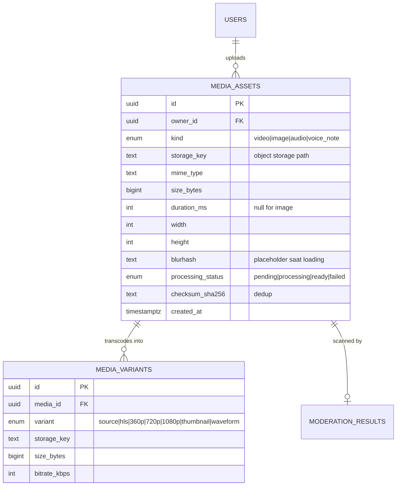
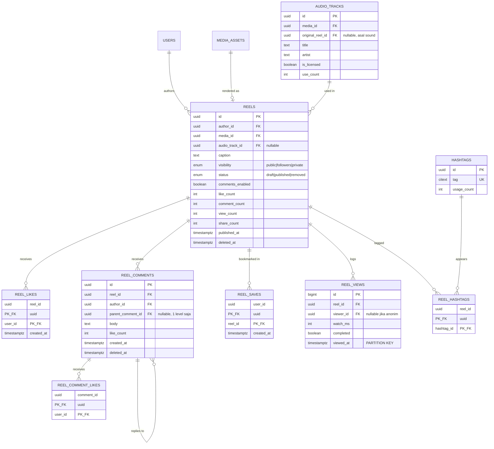
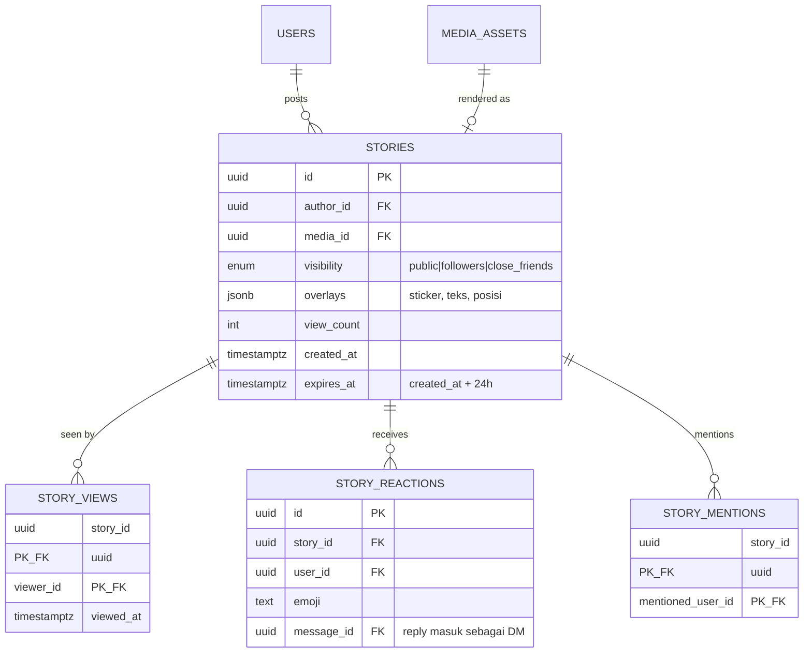
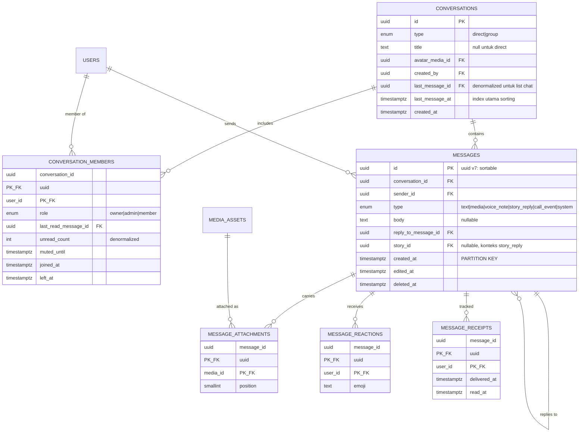
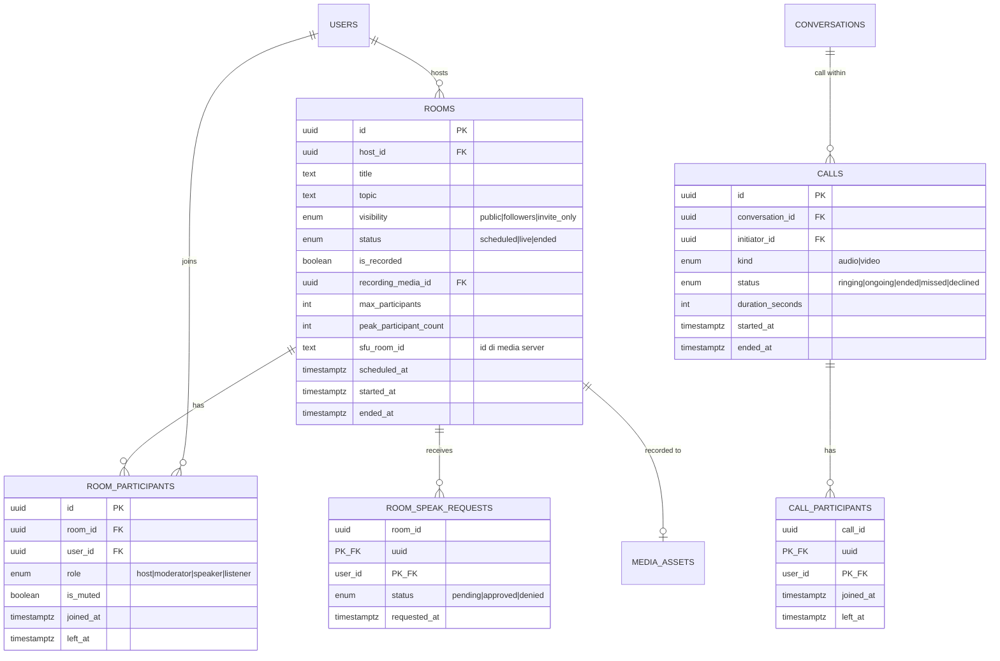
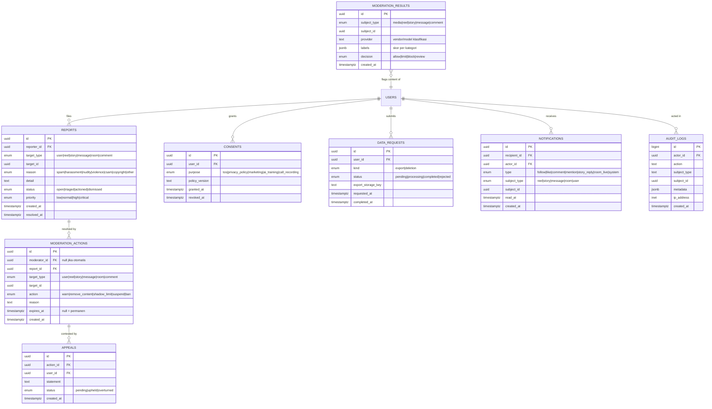

# Syntra — Entity Relationship Diagram

Status: draft v0.1 · Target DB: PostgreSQL 16 · Backend: Go

Dokumen ini menurunkan sketsa "flow kasar" di PRD (story · reels · chat · in-room)
menjadi model data, sekaligus menutup bab yang belum ada di PRD: AI, trust & safety,
privasi/kepatuhan, dan notifikasi.

ERD dipecah per domain. Menggabungkan ~45 entitas dalam satu diagram membuatnya
tidak terbaca, dan batas antar-domain di bawah ini sengaja dibuat sejajar dengan
batas service kalau nanti dipecah.

---

## 0. Konvensi

- PK selalu `uuid` (v7, time-ordered) supaya aman untuk sharding dan tidak membocorkan
  jumlah baris. Pengecualian: tabel event bervolume sangat tinggi memakai `bigint`
  identity karena lebih murah untuk index.
- Semua timestamp `timestamptz`, disimpan UTC.
- Soft delete lewat `deleted_at`, bukan hard delete — dibutuhkan untuk moderasi dan
  jejak audit.
- Counter (`like_count`, dst.) adalah kolom denormalisasi yang di-maintain lewat
  outbox/worker, bukan `COUNT(*)` saat baca.
- `enum` di bawah ditulis sebagai tipe untuk keterbacaan; implementasinya pakai
  lookup table atau `text` + `CHECK`, jangan `ENUM` native Postgres (migrasinya menyakitkan).

---

## 1. Identity & Social Graph

Fondasi. Semua domain lain bergantung ke sini.

```mermaid
erDiagram
    USERS ||--o| USER_PROFILES : has
    USERS ||--o| USER_SETTINGS : has
    USERS ||--o{ USER_AUTH_IDENTITIES : "logs in via"
    USERS ||--o{ DEVICES : owns
    USERS ||--o{ SESSIONS : holds
    USERS ||--o{ FOLLOWS : follows
    USERS ||--o{ BLOCKS : blocks
    USERS ||--o{ MUTES : mutes
    USERS ||--o{ CLOSE_FRIENDS : lists
    DEVICES ||--o{ SESSIONS : "authenticated on"

    USERS {
        uuid id PK
        citext username UK
        citext email UK "nullable, unique when set"
        text phone_e164 UK "nullable"
        text password_hash "argon2id, nullable if OAuth-only"
        date date_of_birth "wajib: age gating"
        enum account_status "active|suspended|deactivated|deleted"
        boolean is_private
        timestamptz created_at
        timestamptz deleted_at
    }

    USER_PROFILES {
        uuid user_id PK_FK
        text display_name
        text bio
        uuid avatar_media_id FK
        uuid cover_media_id FK
        int follower_count "denormalized"
        int following_count "denormalized"
        timestamptz updated_at
    }

    USER_SETTINGS {
        uuid user_id PK_FK
        enum dm_privacy "everyone|following|nobody"
        enum story_privacy "public|followers|close_friends"
        enum room_invite_privacy "everyone|following|nobody"
        boolean discoverable_by_phone
        text locale
        text timezone
        jsonb notification_prefs
    }

    USER_AUTH_IDENTITIES {
        uuid id PK
        uuid user_id FK
        enum provider "google|apple|password"
        text provider_uid
        timestamptz linked_at
    }

    DEVICES {
        uuid id PK
        uuid user_id FK
        enum platform "android|ios|web"
        text push_token "FCM/APNs"
        text app_version
        timestamptz last_seen_at
        timestamptz revoked_at
    }

    SESSIONS {
        uuid id PK
        uuid user_id FK
        uuid device_id FK
        text refresh_token_hash
        inet ip_address
        timestamptz expires_at
        timestamptz revoked_at
    }

    FOLLOWS {
        uuid follower_id PK_FK
        uuid followee_id PK_FK
        enum status "pending|accepted"
        timestamptz created_at
    }

    BLOCKS {
        uuid blocker_id PK_FK
        uuid blocked_id PK_FK
        timestamptz created_at
    }

    MUTES {
        uuid muter_id PK_FK
        uuid muted_id PK_FK
        boolean mute_posts
        boolean mute_stories
    }

    CLOSE_FRIENDS {
        uuid owner_id PK_FK
        uuid friend_id PK_FK
        timestamptz created_at
    }
```

Catatan desain:

- `date_of_birth` wajib, bukan opsional. Tanpa ini tidak ada age gating, dan age gating
  adalah syarat rilis Play Store untuk aplikasi UGC.
- `FOLLOWS.status` menangani akun privat (request follow). Kalau `is_private=false`,
  status langsung `accepted`.
- `BLOCKS` harus dicek di **setiap** query pembacaan konten. Ini beban query yang
  gampang terlupa — sebaiknya jadi satu layer di repository, bukan diulang per handler.

---

## 2. Media (shared)

Satu tabel media dipakai bersama oleh reels, story, chat, dan avatar. Ini keputusan
penting: kalau tiap domain punya tabel media sendiri, pipeline transcoding dan
moderasi harus ditulis empat kali.



Catatan desain:

- **File binary tidak pernah masuk Postgres.** Yang disimpan hanya `storage_key` ke
  object storage (S3/GCS/R2). Upload pakai presigned URL langsung dari klien ke storage,
  backend hanya menerbitkan URL dan menerima callback — jangan proxy byte video lewat Go.
- `checksum_sha256` memungkinkan dedup. Untuk aplikasi video ini bukan optimasi kecil:
  konten viral yang di-repost ribuan kali bisa berbagi satu blob.
- `processing_status` wajib ada karena reels tidak bisa tayang sebelum transcoding selesai.
  Ini yang bikin reels beda dari chat: ada state asinkron di tengah alur publish.

---

## 3. Reels



Catatan desain:

- `AUDIO_TRACKS` adalah mekanik yang bikin format short-video menyebar (satu sound dipakai
  ribuan orang). Kalau tabel ini dilewat, reels cuma jadi galeri video biasa. `is_licensed`
  penting karena audio berhak cipta adalah sumber takedown nomor satu.
- `REEL_VIEWS` adalah tabel terpanas di sistem — satu baris per tayangan. **Wajib partisi
  per hari** dan sebaiknya tidak di Postgres primary sama sekali; alirkan ke ClickHouse
  atau BigQuery lewat queue, simpan agregatnya saja di `REELS.view_count`. Kalau ini
  dibiarkan di tabel biasa, database akan mati jauh sebelum produknya laku.
- `parent_comment_id` dibatasi satu level. Threading tak terbatas terlihat keren di ERD
  dan menyiksa saat query.

---

## 4. Stories



Catatan desain:

- `expires_at` bukan berarti baris dihapus jam 24:00. Query pembacaan memfilter
  `expires_at > now()`, dan job harian memindahkan yang kedaluwarsa ke arsip. Alasannya:
  moderasi dan permintaan hukum bisa datang setelah story hilang dari UI.
- Balasan story mendarat di `MESSAGES` (domain 5), bukan tabel sendiri. Inilah titik
  sambung "story → chat" yang di sketsa digambar sebagai panah dari feed ke layar hijau.

---

## 5. Chat



Catatan desain:

- **`MESSAGE_RECEIPTS` hanya untuk grup.** Untuk chat 1:1, `last_read_message_id` di
  `CONVERSATION_MEMBERS` sudah cukup dan jauh lebih murah — receipt per-pesan per-anggota
  tumbuh O(pesan × anggota). Untuk grup 200 orang, satu pesan = 200 baris. Kalau centang
  biru per-anggota tidak masuk MVP, buang tabel ini dulu.
- `MESSAGES` pakai UUIDv7 supaya urut secara waktu, jadi pagination cursor-based bisa
  langsung pakai PK tanpa index tambahan.
- Presence (online/typing) **tidak ada di ERD ini** dan memang tidak boleh masuk Postgres —
  itu state efemeral, tempatnya di Redis dengan TTL.
- Keputusan yang belum diambil dan harus diambil sebelum coding: **E2EE atau tidak.**
  Kalau ya, `body` jadi ciphertext, butuh tabel `USER_PREKEYS` / `DEVICE_KEYS` (Signal
  protocol), dan konsekuensinya moderasi sisi server jadi mustahil serta search pesan
  harus di klien. Ini trade-off produk, bukan trade-off teknis — perlu diputuskan di PRD.

---

## 6. Voice Rooms & Calls

Ini bagian "in room" di sketsa — yang paling belum terdefinisi di PRD.



Catatan desain:

- **Audio tidak lewat Postgres dan tidak lewat Go.** Tabel ini hanya menyimpan metadata
  sesi; media stream ditangani SFU (LiveKit / mediasoup / Janus). `sfu_room_id` adalah
  jembatannya. Backend Go berperan sebagai penerbit token join dan pemegang otoritas peran.
- `ROOM_PARTICIPANTS` sengaja punya PK sendiri, bukan composite — satu orang bisa
  keluar-masuk room berkali-kali dalam satu sesi, dan tiap sesi perlu tercatat.
- `is_recorded` punya implikasi hukum: perekaman suara butuh consent eksplisit dari
  semua peserta di banyak yurisdiksi. Kalau fitur ini masuk, `CONSENTS` di domain 8 harus
  ikut dipakai.

---

## 7. AI Layer

Domain ini menjawab kontradiksi terbesar di PRD: nama "Syntra" menjanjikan AI synthesis,
tapi belum ada satu pun fitur AI yang didefinisikan. Struktur di bawah cukup generik untuk
menampung use case apa pun yang nanti dipilih, tanpa memaksa keputusan sekarang.

```mermaid
erDiagram
    USERS ||--o{ AI_JOBS : requests
    AI_JOBS ||--o| AI_RESULTS : produces
    USERS ||--o| USER_INTEREST_VECTORS : profiled
    CONTENT_EMBEDDINGS }o--|| MEDIA_ASSETS : embeds

    AI_JOBS {
        uuid id PK
        uuid user_id FK
        enum kind "caption_gen|transcribe|translate|summarize_room|moderate|recommend"
        enum subject_type "reel|story|message|room|media"
        uuid subject_id
        enum status "queued|running|succeeded|failed"
        text model_id "audit: model mana yang dipakai"
        int input_tokens
        int output_tokens
        numeric cost_usd
        text error
        timestamptz created_at
        timestamptz completed_at
    }

    AI_RESULTS {
        uuid job_id PK_FK
        jsonb payload "bentuk tergantung kind"
        numeric confidence
        boolean accepted_by_user "sinyal kualitas"
    }

    CONTENT_EMBEDDINGS {
        uuid id PK
        enum content_type "reel|story|audio|profile"
        uuid content_id
        vector embedding "pgvector, 768/1536 dim"
        text model_id
        timestamptz created_at
    }

    USER_INTEREST_VECTORS {
        uuid user_id PK_FK
        vector embedding
        timestamptz updated_at
    }
```

Catatan desain:

- `cost_usd` dan token count ada di skema sejak awal dengan sengaja. Biaya inferensi AI
  adalah biaya variabel per pengguna; kalau tidak diukur dari hari pertama, tidak akan
  ketahuan sampai tagihannya datang.
- `CONTENT_EMBEDDINGS` pakai `pgvector`. Selama korpus masih di bawah ~1 juta item, ini
  cukup dan menghemat satu komponen infrastruktur. Di atas itu, pindah ke vector DB khusus.
- `accepted_by_user` adalah kolom kecil yang bernilai besar: ini satu-satunya sinyal
  murah untuk mengukur apakah fitur AI-nya benar-benar berguna atau cuma dekorasi.

---

## 8. Trust & Safety, Privasi, Notifikasi

Bab yang paling sering ditunda dan paling mahal kalau ditunda.



Catatan desain:

- `REPORTS.reason` memuat `csam` sebagai kategori terpisah dengan `priority=critical`.
  Ini bukan detail kosmetik: kategori itu punya kewajiban pelaporan hukum dan SLA
  penanganan yang berbeda total dari spam, dan harus bisa dirutekan secara khusus.
- `CONSENTS` menyimpan `policy_version`. Consent tanpa versi kebijakan tidak berguna
  saat audit — kamu perlu bisa membuktikan pengguna menyetujui teks yang mana.
- `DATA_REQUESTS` mengimplementasikan hak akses dan hak hapus di UU PDP. Menambahkannya
  sekarang berarti satu tabel; menambahkannya setelah 20 tabel penuh data berarti proyek
  tersendiri.
- `AUDIT_LOGS` khusus aksi bernilai tinggi (login, ganti password, aksi moderasi, akses
  data), bukan log semua request.

---

## 9. Pemetaan fase

ERD lengkap di atas **bukan scope MVP**. Ini peta tujuan; yang dibangun duluan sebaiknya
satu pilar saja, sesuai catatan di analisis PRD.

> **Urutan di bawah sudah direvisi.** Setelah membaca `catatan-untuk-app.md`, ternyata
> **story sudah menjadi bagian layar utama** di aplikasi Android yang dibangun —
> bukan fitur fase 2. Urutan pengerjaan yang berlaku sekarang ada di
> [`app-backend-alignment.md`](app-backend-alignment.md) §7. Tabel di bawah tetap
> berguna sebagai pengelompokan entitas per domain.

| Fase | Domain | Entitas | Sudah dibuat? |
|---|---|---|---|
| **MVP** | Identity, Media, Chat, T&S minimum | `USERS`, `USER_PROFILES`, `USER_SETTINGS`, `DEVICES`, `FOLLOWS`, `BLOCKS`, `MEDIA_ASSETS`, `CONVERSATIONS`, `CONVERSATION_MEMBERS`, `MESSAGES`, `MESSAGE_ATTACHMENTS`, `REPORTS`, `MODERATION_ACTIONS`, `CONSENTS`, `NOTIFICATIONS` | ✅ migrasi 1 |
| **MVP (naik dari fase 2)** | Story | `STORIES`, `STORY_VIEWS` | ✅ migrasi 4 |
| **Fase 2** | Reels + sisa story | `STORY_REACTIONS`, `REELS`, `REEL_LIKES`, `REEL_COMMENTS`, `REEL_VIEWS`, `HASHTAGS`, `AUDIO_TRACKS`, `MODERATION_RESULTS` | belum |
| **Fase 3** | Voice rooms | `ROOMS`, `ROOM_PARTICIPANTS`, `ROOM_SPEAK_REQUESTS`, `CALLS`, `CALL_PARTICIPANTS` |
| **Fase 4** | AI layer | `AI_JOBS`, `AI_RESULTS`, `CONTENT_EMBEDDINGS`, `USER_INTEREST_VECTORS` |
| **Sesuai kebutuhan** | Compliance & appeal | `DATA_REQUESTS`, `APPEALS`, `AUDIT_LOGS`, `MUTES`, `CLOSE_FRIENDS` |

---

## 10. Yang sengaja TIDAK masuk Postgres

Sama pentingnya dengan yang masuk:

| Data | Tempatnya | Alasan |
|---|---|---|
| Presence, typing indicator | Redis + TTL | Efemeral, write sangat sering, tidak perlu durabel |
| Unread badge realtime | Redis counter | Denormalisasi di Postgres cukup sebagai sumber kebenaran |
| Feed timeline | Redis / precomputed store | Fanout-on-write; `SELECT` join saat baca tidak akan sanggup |
| Byte video/audio/gambar | Object storage + CDN | Sudah jelas |
| `REEL_VIEWS` mentah | ClickHouse / BigQuery | Volume analitik, bukan volume transaksional |
| Rate limit counter | Redis | — |

---

## 11. Keputusan yang masih menggantung

Harus dijawab di PRD sebelum migrasi pertama ditulis:

1. **E2EE untuk chat: ya atau tidak.** Ini mengubah `MESSAGES` secara fundamental dan
   menentukan apakah moderasi sisi server mungkin dilakukan.
2. **Apa fitur AI yang sebenarnya.** Domain 7 saat ini adalah wadah kosong yang dirancang
   fleksibel — tapi wadah kosong tidak bisa dijadwalkan.
3. **Reels: rekomendasi algoritmik atau kronologis.** Jawaban "algoritmik" berarti
   `CONTENT_EMBEDDINGS` dan pipeline ranking naik dari fase 4 ke fase 2.
4. **Target geografi.** Menentukan region data residency dan apakah GDPR ikut berlaku
   di samping UU PDP.
5. **Single-region atau multi-region.** Kalau multi, `uuid` v7 dan strategi partisi di
   atas sudah siap; kalau tidak, sebagian kompleksitas bisa dibuang sekarang.
